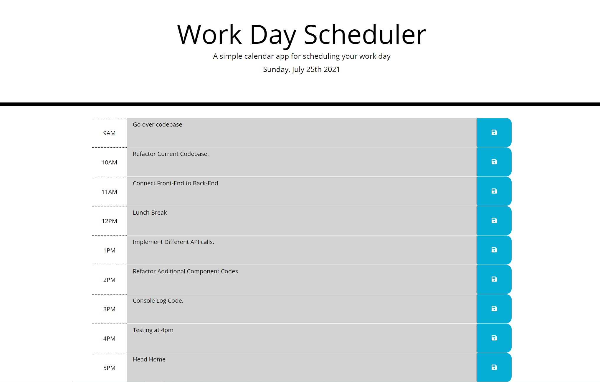

# Work Day Scheduler

## Description

Create a simple calendar application that allows a user to save events for each hour of the day. This app will run in the browser and feature dynamically updated HTML and CSS powered by jQuery. 

Deployed Website:
https://todd1terry1.github.io/workday-scheduler/

Technologies Used:

* HTML
* CSS
* JavaScript/JQuery

