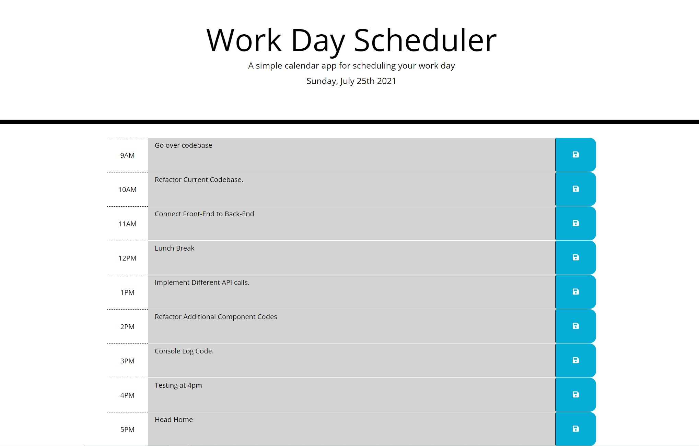

# Work Day Scheduler

## Description

Create a simple calendar application that allows a user to save events for each hour of the day. This app will run in the browser and feature dynamically updated HTML and CSS powered by jQuery. A work schedule generally refers to the days per week and the hours per day that an employee is expected to be at their job. There are several different types of work schedules, which vary based on the organization and the position.

## Deployed Website

<

### Built With

* HTML
* CSS
* JavaScript/JQuery

